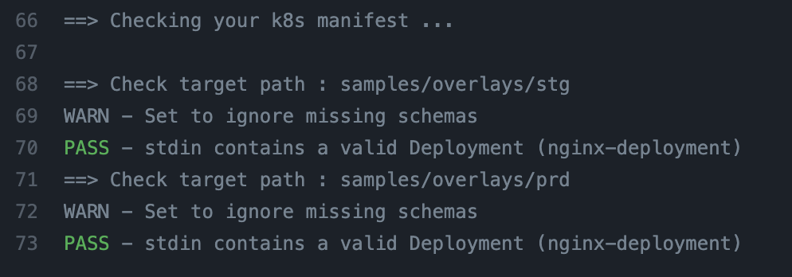

# kubeval-kz-outputs-action

## About

This action simply do kubeval your kustomize outputs in multiple directories you want to check.

If you want to check under multiple directories or multiple environments under overlays, 
You can use it only defining a directory.

## Usage

```yaml
on: [push]

jobs:
  this-is-example:
    runs-on: ubuntu-latest
    name: check your manifest.
    steps:
      - name: Checkout
        uses: actions/checkout@v2
        with:
          fetch-depth: 0 # required!
      - name: check manifest
        uses: wadason/kubeval-kz-outputs-action@v1
        with:
          pathList: k8s/apps, k8s/guestbook
          envList: staging, production
```

Here is outputs in workflow.

